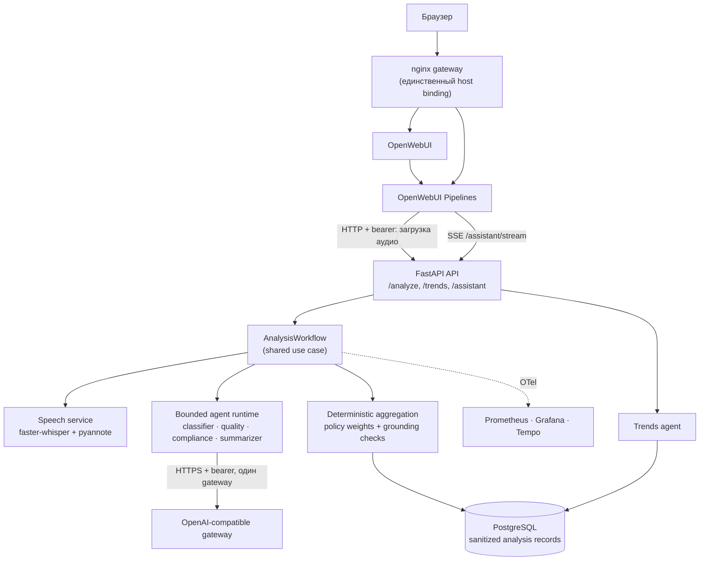

# MTBank AI Call Analytics

Сервис речевой аналитики контакт-центра: принимает запись звонка, транскрибирует её
**локальным** ASR с диаризацией, прогоняет четыре независимых LLM-агента, детерминированно
сводит их результаты в один типизированный контракт и складывает обезличенную запись в
PostgreSQL. Работает как настоящий OpenWebUI Pipeline и как REST API — через один и тот же
workflow.

Инженерно интересен тем, что LLM здесь — один из этапов проверяемого pipeline: неверная
схема ответа модели, неразрешённые роли спикеров или дрейф провайдера **не превращаются в
частичный успех**, а score и compliance считаются кодом, а не моделью.

[](https://github.com/bigidulka/mtbank-ai-call-analytics/actions/workflows/ci.yml)

## Problem

Контакт-центр записывает звонки, но качество разговора проверяет человек: он слушает
запись, вручную заполняет чек-лист, ищет нарушения скрипта и пересказывает суть обращения.
Это медленно, невоспроизводимо и не даёт агрегированной картины по потоку звонков.

Автоматизация упирается в четыре требования банковского контекста: аудио не должно уходить
во внешний облачный ASR, результат анализа должен быть объясним (на что именно опирается
вывод), оценка должна быть одинаковой при повторном прогоне, а сбой модели не должен
выглядеть как успешный анализ.

## Solution

Один canonical workflow обслуживает оба входа (OpenWebUI чат и `POST /analyze`):

1. **Speech.** Аудио нормализуется и уходит в локальный speech-сервис: `faster-whisper`
   `large-v3-turbo` (CTranslate2) даёт сегменты со временем, локальный `pyannote`
   Community-1 — диаризацию. Роли `Оператор`/`Клиент` назначает отдельный bounded-агент с
   типизированным ответом; спорные случаи остаются fail-closed.
2. **Agents.** Четыре независимых агента (`classifier`, `quality`, `compliance`,
   `summarizer`) работают параллельно в bounded runtime: review-prompts, retrieval-first
   tools (транскрипт + policy-документы), лимиты по времени/токенам, retry и circuit
   breaker, завершение только через typed terminal submit.
3. **Aggregation.** Fan-in проверяет ссылки на segment IDs, считает `quality_score.total`
   по весам policy, определяет `compliance.passed` и решает, нужен ли review. Здесь нет
   LLM — только код и политики из `src/mtbank_ai/policies/`.
4. **Persistence & observability.** В PostgreSQL попадает только обезличенная запись
   (никаких колонок с сырым аудио, транскриптом или промптом). Метрики и трейсы уходят в
   Prometheus/Grafana/Tempo через OpenTelemetry.

## Key Features

- **Локальный канонический ASR**: local `faster-whisper` `large-v3-turbo` (CTranslate2) и
  local pyannote Community-1, без облачного fallback; артефакты моделей верифицируются по
  SHA-256 из `models/manifest.json`.
- **Настоящий OpenWebUI Pipeline** с attachment flow, а не заглушка на FastAPI:
  `pipeline.py` ходит в тот же workflow, что и REST.
- **Четыре независимых агента** с разными prompts/tools/contracts и параллельным запуском.
- **Typed contracts и fail-closed семантика**: `terminal_submit_invalid`, unresolved roles,
  provider drift и неподдерживаемое аудио завершают run ошибкой, а не «частичным» ответом.
- **Grounded evidence**: classification, quality и summary ссылаются на конкретные
  `segment_id` неизменяемого транскрипта; ссылка на несуществующий сегмент отклоняется.
- **Детерминированная агрегация** score и compliance по версионированным policy-файлам.
- **Наблюдаемость из коробки**: provisioned Grafana dashboard, Prometheus-метрики вызовов,
  качества, тем, ошибок и токенов агентов, трейсы через OTel Collector в Tempo.
- **Версионируемый evidence**: финальные JSON-файлы связаны SHA-256-манифестом и не
  содержат ни аудио, ни транскриптов, ни ключей.
- **WebSocket режим (opt-in)**: rolling provisional транскрипт + повторный canonical
  full-batch проход и reconciliation.
- **Ассистент по звонкам**: bounded multi-turn агент со safe progress labels; аргументы
  инструментов и hidden reasoning не покидают runtime.

## Architecture



`gateway` — единственный сервис, публикующий порт хоста; API, speech, PostgreSQL и
monitoring живут во внутренних сетях. Диаграмма отражает фактический путь кода
(`pipeline.py` → `src/mtbank_ai/pipeline_bridge.py` → `workflow/analysis.py`), а не желаемую
архитектуру. Последовательность обработки — в [docs/architecture.md](docs/architecture.md).

## Engineering Decisions

**Decision: собственный bounded Supervisor вместо LangGraph.**
**Why:** граф фиксирован — `speech → 4 параллельных агента → детерминированная агрегация`;
checkpoint/state-machine слой не даёт ничего, кроме зависимости.
**Trade-off:** нет готовой персистентности графа и визуализации; цикл model/tools/deadline
поддерживается своим кодом и тестами.

**Decision: завершение агента только через типизированный terminal submit.**
**Why:** банковская аналитика, построенная на «почти правильном» JSON, опаснее отказа:
неверная схема должна ломать run.
**Trade-off:** дрейф провайдера приводит к отказу всего анализа вместо деградации; transient
ретраи разрешены только для `429/500/502/503/504`.

**Decision: score и compliance считает код, а не LLM.**
**Why:** супервайзеру нужна воспроизводимая оценка; повторный прогон одного звонка обязан
дать тот же `quality_score.total`.
**Trade-off:** веса и правила живут в policy-файлах и меняются только через ревью.

**Decision: evidence привязывается к segment IDs и проверяется на fan-in.**
**Why:** каждое утверждение агента должно быть проверяемо по неизменяемому транскрипту.
**Trade-off:** у агентов появляется дополнительный режим отказа — ссылка на несуществующий
или неразрешённый сегмент.

**Decision: один canonical workflow для OpenWebUI и REST.**
**Why:** демо и backend не должны расходиться; attachment flow проверяется тем же кодом.
**Trade-off:** пути UI и API нельзя развивать независимо.

**Decision: локальный ASR без облачного fallback.**
**Why:** аудио контакт-центра не должно покидать контур; облако допустимо только как
provisional streaming по явному решению.
**Trade-off:** CPU-режим медленный (см. Limitations), для целевого SLA нужен GPU.

**Decision: хранить только обезличенные записи.**
**Why:** privacy by construction — в схеме БД физически нет колонок с сырым аудио,
транскриптом и промптами (закреплено `tests/unit/test_storage_contract.py`).
**Trade-off:** повторный скоринг исторических звонков требует повторного прогона ASR и
агентов по исходному аудио.

## Tech Stack

| Слой | Технологии |
|---|---|
| Backend | Python 3.11, FastAPI, Starlette, Pydantic v2, uvicorn, httpx, websockets |
| Данные | PostgreSQL, SQLAlchemy 2 (async), asyncpg, Alembic |
| AI / речь | faster-whisper (CTranslate2) `large-v3-turbo`, pyannote `speaker-diarization-community-1`, OpenAI-compatible gateway, OpenWebUI + Pipelines |
| Наблюдаемость | OpenTelemetry SDK, Prometheus, Grafana (provisioned dashboard), Tempo |
| Инфраструктура | Docker Compose, nginx gateway, uv (lock-файлы), GitHub Actions |
| Качество | pytest (646 тестов), ruff (lint + format), pyright, детерминированные static-сканы |

## Quick Start

### 1. Offline demo (без модели, GPU, сети и ключей)

```bash
git clone https://github.com/bigidulka/mtbank-ai-call-analytics.git
cd mtbank-ai-call-analytics
uv sync --frozen --all-groups
uv run python scripts/demo_offline.py
```

Скрипт проигрывает синтетический reference-звонок через **реальные** контракты: промпты
агентов, tool registry, typed terminal validation, grounding-проверки и детерминированный
fan-in. Ответ модели подменён детерминированным scripted-провайдером
(`offline demo / scripted provider / synthetic data`), поэтому качество модели этот прогон не
измеряет.

```bash
# Тот же прогон с локально добавленной строкой-нарушением: показывает fail-closed путь
uv run python scripts/demo_offline.py --inject-violation
```

### 2. Полный стек

Требования: Docker Compose, FFmpeg, ~16 ГБ RAM, ~12 ГБ диска, OpenAI-совместимый gateway и
HF-токен (только для скачивания gated-артефакта диаризации).

```bash
cp .env.example .env
# Заполнить все пустые секреты, gateway/model и текущий code SHA:
#   MTBANK_WORKFLOW__CODE_SHA=$(git rev-parse HEAD)

HF_TOKEN=... uv run python scripts/provision_speech_models.py \
  --artifact-root models/artifacts \
  --output-manifest models/manifest.json \
  --cache-dir .cache/mtbank-speech-models

docker compose up --build --wait
```

OpenWebUI: <http://localhost:3000>. Runtime работает offline и падает в readiness, если
манифест или хэши артефактов не совпадают. GPU-профиль для целевого SLA:

```bash
docker compose -f docker-compose.yml -f docker-compose.gpu.yml --profile gpu up --build --wait
```

## Demo

| Что показать | Команда | Что это доказывает |
|---|---|---|
| Offline demo | `uv run python scripts/demo_offline.py` | Контракты, tools, grounding, детерминированный fan-in — без модели и GPU |
| Fail-closed путь | `uv run python scripts/demo_offline.py --inject-violation` | Blocking-нарушение не превращается в `compliance.passed=true` |
| Нагрузка без GPU | `uv run pytest -m "not integration and not real_llm and not gpu"` | 577 offline-тестов за ~10 секунд |
| Реальные метрики | [`release-evidence/final-115/`](release-evidence/final-115/) | Измеренные WER/DER/role accuracy и SLA на GPU |
| Схема стека | `docker compose config --services` | 13 сервисов, один host binding (nginx gateway) |

## API Examples

```bash
curl -X POST http://127.0.0.1:8000/analyze \
  -H "Authorization: Bearer $MTBANK_API_KEY" \
  -F "file=@test_data/synthetic/mobile-app-security-16k.ogg"
```

```json
{
  "transcript": [{"speaker": "Оператор", "start": 0.0, "end": 4.2, "text": "..."}],
  "classification": {"topic": "карты", "priority": "medium"},
  "quality_score": {"total": 100, "checklist": {"greeting": true}},
  "compliance": {"passed": true, "issues": []},
  "summary": "...",
  "action_items": ["..."]
}
```

Также доступны `POST /trends`, `POST /assistant`, `POST /assistant/stream` (SSE) и
`WSS /ws/transcribe`. Полный контракт, включая коды ошибок и границы потоковых событий —
[docs/api.md](docs/api.md).

## Measured Evidence

Синтетический корпус: пять authored-диалогов, 714.802 секунды, WAV/MP3/OGG, 8/16 kHz, с
SHA-256 provenance в [`test_data/manifest.yaml`](test_data/manifest.yaml).

| Метрика | Значение | Артефакт |
|---|---:|---|
| Micro aggregate (5 файлов, 714.802 с) | WER **7.34%**, DER **20.30%**, role accuracy **83.97%** | [`canonical-speech-evaluation.json`](release-evidence/final-115/canonical-speech-evaluation.json) |
| Публичный анализ файла 300 с | **27.880 с** (GPU, HTTPS) | [`public-five-minute-sla.json`](release-evidence/final-115/public-five-minute-sla.json) |
| WebSocket provisional p95 | **632.830 мс** | [`websocket-p95.json`](release-evidence/final-115/websocket-p95.json) |
| Canonical reconciliation после стрима | **21.050 с** | там же |
| CPU-прогон 300 с файла | 483.178 с, `within_sla=false` | [`local-faster-whisper-five-minute-cpu.json`](test_data/evaluations/local-faster-whisper-five-minute-cpu.json) |

Все значения взяты из версионированных артефактов; ничего не измерялось заново для README.

## Testing

```bash
uv run ruff check .
uv run ruff format --check .
uv run pyright
uv run pytest -m "not integration and not real_llm and not gpu"   # 577 passed, 69 skipped
uv run python scripts/check_release_static.py secrets             # deterministic secret scan
uv run python scripts/check_release_static.py locks
```

`integration`, `real_llm` и `gpu` маркеры требуют одноразовый PostgreSQL, реальный gateway и
GPU-runner соответственно; без них тесты корректно скипаются, а не падают.

## Project Structure

```text
pipeline.py                 # OpenWebUI Pipeline (attachment flow, assistant bridge)
src/mtbank_ai/
  workflow/                 # shared use case: speech → agents → aggregation
  agent_runtime/            # bounded model/tool loop, retry, typed terminal submit
  agents/                   # четыре агента: prompts, tools, contracts
  policies/                 # taxonomy, quality rubric, compliance rules (YAML)
  speech/                   # клиент speech-сервиса, контракты, dataset-манифест
  storage/                  # модели, репозитории, Alembic-миграции
  api/                      # HTTP/WS точки входа
services/speech/            # локальный ASR + диаризация + role agent
monitoring/                 # Prometheus, Grafana dashboard, Tempo, OTel collector
scripts/                    # demo, провижининг моделей, бенчмарки, static-сканы
tests/                      # unit / contract / integration / release
```

## Failure Handling

- **Недоступен LLM-gateway** — retry с backoff только для transient-кодов, затем run
  завершается ошибкой; частичный анализ не публикуется.
- **Модель вернула невалидную схему** — `terminal_submit_invalid`, run падает.
- **Не разрешены роли спикеров** — анализ останавливается до запуска агентов.
- **Speech-сервис недоступен** — `remote_https` транспорт не имеет локального fallback,
  workflow закрывается ошибкой.
- **Ошибка персистентности** — транзакция БД откатывается, детали наружу не выходят.
- **Обрыв клиента на стриме** — активная работа provider/tool отменяется; незавершённый
  поток не получает `done`.
- **Малая выборка в trends** — когорты ниже privacy-порога подавляются.

## Limitations

- Корпус — **синтетический** (5 диалогов, 714.802 с); реальные клиентские данные не
  использовались и требуют отдельного согласования.
- Публичное демо остановлено; воспроизводимость обеспечивается локальным запуском и
  версионированным evidence.
- CPU-режим не укладывается в целевой SLA (483 с на 300 с аудио); для 27.880 с нужен GPU.
- Веса моделей не хранятся в репозитории: их нужно провижионить отдельно по манифесту.
- WebSocket provisional режим требует Groq-credentials и по умолчанию выключен.
- Нет внешней attestation модельных артефактов и production SLO; список открытых gates —
  [docs/release-checklist.md](docs/release-checklist.md).
- Проект вырос из тестового задания МТБанка: соответствие критериям задания вынесено в
  [docs/assignment-coverage.md](docs/assignment-coverage.md).

## AI-assisted Development

AI использовался как инструмент реализации: черновики отдельных модулей и тестов,
рефакторинг, исследование API внешних сервисов и подготовка документации. 31 из 78
коммитов содержат `Co-Authored-By: Claude`; журналы задач агентов остаются локальными и в
репозиторий не попадают.

Проверка результата:

- полный offline-набор тестов (577 passed) и контрактные тесты схем;
- `ruff` (lint + format) и `pyright` в CI;
- детерминированные static-сканы (`scripts/check_release_static.py secrets|locks`);
- hash-pinned evidence: `release-evidence/final-115/manifest.json` связывает артефакты;
- контрактный тест побайтово фиксирует исходный текст задания;
- ручной ревью промптов, политик и границ потоковых событий.

## Provenance & License

Исходный код реализации — MIT (см. [LICENSE](LICENSE)). Текст задания
([`docs/assignment.md`](docs/assignment.md)) и синтетические reference-данные принадлежат
автору задания и под MIT не передаются — детали в [NOTICE.md](NOTICE.md).
