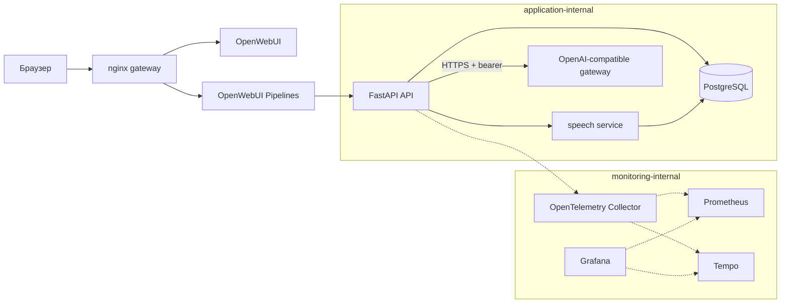
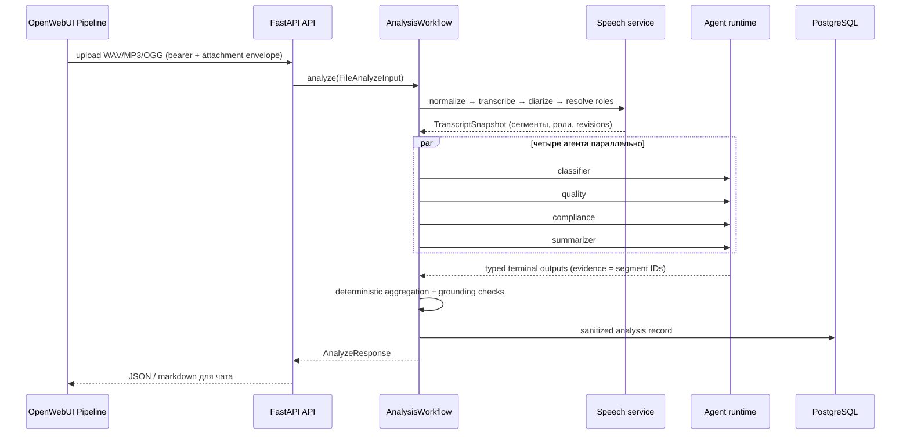

# Architecture

Исходное задание сохранено без изменений в [assignment.md](assignment.md). Принятые
границы описаны в ADR `0001`–`0004` в [adr/](adr/).

Последовательность одного анализа:

`gateway` — единственный host binding; API, speech, PostgreSQL и monitoring не
публикуют порт хоста. Text chat проходит `OpenWebUI Pipeline generator → authenticated
/assistant/stream SSE → bounded model/tool loop → provider stream`; наружу выходят
только safe progress и final-answer deltas. Buffered `/assistant` собирает тот же stream.
Один shared speech workflow используется REST и OpenWebUI Pipeline:
безопасная загрузка/normalization → canonical speech → четыре bounded agents
(`classifier`, `quality`, `compliance`, `summarizer`) → deterministic aggregation →
sanitary persistence.

Evidence хранит версии кода, policies/prompts, dataset, speech-компонентов и моделей,
а также hashes. Он не предназначен для хранения аудио, transcript, prompt, provider
response или ключей. Текущая архитектура не доказывает release readiness: реальный
cloud E2E, local model artifacts, GPU и Grafana evidence остаются gates из
[release-checklist.md](release-checklist.md).
